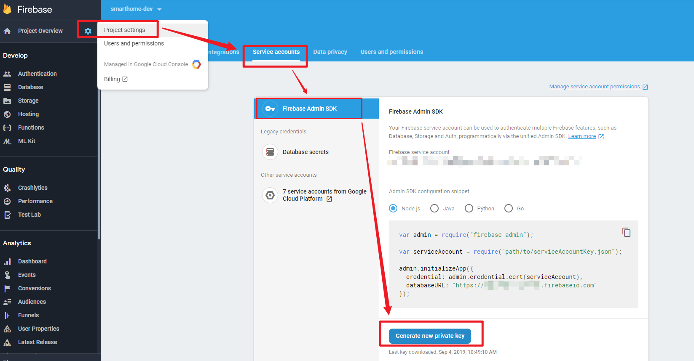
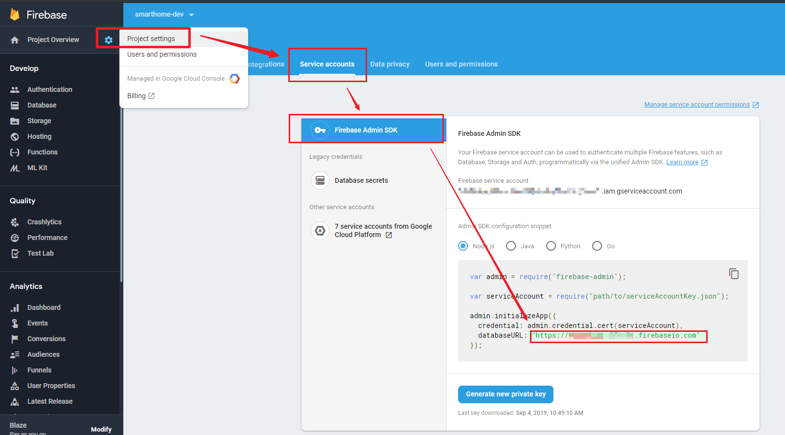

# Firestore 数据库导入导出脚本


用于将 Firestore 中的数据导入导出工具,可以用备份/添加 Firestore 数据

## 要求

1. 运行环境: NodeJS 环境/可以运行 JavaScript 脚本的环境

2.  Firebase 控制台密钥: `Firebase Console` > `Project Settings` > `Service accounts` > `Firebase Admin SDK` > **Generate new private key** 下载 key.json, 并将其保存为 **serviceAccountKey.json** 到本项目中。



3.将 **export.js**/**import.js**  脚本中的项目 **URL** 为你的项目 **URL**



-   export.js/import.js 

    ```javas
    // 将数据库的地址替换为你自己的 URL
    admin.initializeApp({
      credential: admin.credential.cert(serviceAccount),
      databaseURL: "https://XXXXXXX.firebaseio.com"
    });
    ```


## 使用

下载/克隆此仓库

```shell
git clone https://github.com/QinYUN575/firestore-import-export.git
```
安装 NPM 依赖包

```shell
npm install
```


## 导出数据

使用 export.js 脚本从 Firestore 导出 **集合**/及**子集合**数据到 **firestore-export.json** 文件


```shell
node export.js <your-collection-name> <sub-collection-name-(optional)>
```

>   集合: collection
>
>   子集合: sub-collection


## 导入数据

这将导入一个集合到 Firestore 将覆盖该集合中的任何文件，其 id 与 json 中的 ID 相匹配。 如果您的 JSON 中有**date** 类型，请将该字段添加到命令行。 ***data 和 geo 为可选项**. 

```shell
node import.js import-to-firestore.json date=date geo=Location
```

>    示例文件 **import-to-firestore.json**。 **”test“**将是集合名称。 **data** 类型中将包含  **”_seconds“** 和 **“_nanoseconds”**。


```json
{
  "test" : {
    "first-key" : {
      "email"   : "dungnq@itbox4vn.com",
      "website" : "dalenguyen.me",
      "custom"  : {
        "firstName" : "Dale",
        "lastName"  : "Nguyen"
      },
      "date": {
        "_seconds":1534046400,
        "_nanoseconds":0
      },
      "Location": {
        "_latitude": 49.290683,
        "_longitude": -123.133956
      }
    },
    "second-key" : {
      "email"   : "test@dalenguyen.me",
      "website" : "google.com",
      "custom"  : {
        "firstName" : "Harry",
        "lastName"  : "Potter"
      },
      "date": {
        "_seconds":1534262435,
        "_nanoseconds":0
      },
      "Location": {
        "_latitude": 49.290683,
        "_longitude": -123.133956
      }
    }
  }
}
```


## 感谢

此 repository 搬运自  `https://github.com/dalenguyen/firestore-import-export.git`,

原 repository 作者 [Dale Nguyen](http://dalenguyen.me/) 


**如果对本脚有疑问，请在原 [repository](https://github.com/dalenguyen/firestore-import-export.git)  提交 issue, 感谢[大佬](https://github.com/dalenguyen) **